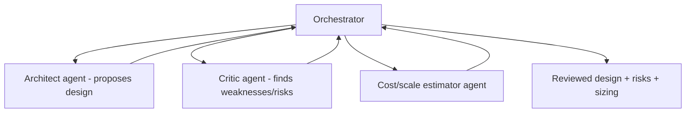

# System Design Assistant — AGENT DESIGN

General patterns: AGENT_GUIDE.md. Mostly conversational + workflow; one optional multi-agent review.

## Core: conversational workflow
The design assistant is a guided conversation, not an autonomous agent: user ↔ LLM, with tool calls to #2 (grounding) and diagram/ADR generators. Deterministic enough to be reliable; the LLM reasons, the user steers.

## Multi-agent design review (V2)

Architect proposes, critic stress-tests (failure modes, bottlenecks), cost agent does back-of-envelope sizing. Reserve for deep reviews; default is single-assistant.

## Interview-prep agent
An **AI interviewer** persona runs a scenario (asks requirements, probes tradeoffs, escalates scale) + a **coach** scores against a rubric (LLM-as-judge). Bounded conversation, not autonomous.

## Communication
Shared design state (Postgres); agents read/write the current design doc (blackboard). Grounding via #2 as a tool.

## Guardrails
Grounded claims cite real components; generic advice flagged; ADRs/Mermaid validated; no hallucinated infrastructure facts. Read-only grounding. See [GUARDRAILS.md](./GUARDRAILS.md).

## Frameworks
Thin orchestration default; LangGraph for the V2 multi-agent review; Claude Agent SDK for Claude-native. Behind our interfaces.
