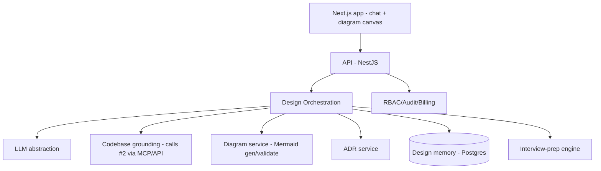

# System Design Assistant — ARCHITECTURE

## Components
| Component | Job | Tech |
|-----------|-----|------|
| Web app | Chat + diagram canvas + ADR editor | Next.js + Mermaid render |
| Design orchestration | Compose design conversations, tradeoffs, outputs | NestJS + `packages/llm` |
| Codebase grounding | Pull real architecture from #2 (MCP/API) | client to Codebase Intelligence |
| Diagram service | Generate + validate Mermaid (parse-check) | LLM + mermaid parser |
| ADR service | Draft/store/version ADRs | NestJS + Postgres |
| Design memory | Persist/version designs + decisions | Postgres (reuse #1 context store) |
| Interview-prep | AI interviewer + rubric scoring | `packages/llm` + `packages/evals` |

## Boundaries
Grounding is a clean client to #2 (reuse, don't rebuild retrieval). Design memory reuses #1's context store. Interview-prep shares the engine but is a separate UX/market.

## Data flow (grounded design)
Problem → orchestration → (optional) grounding via #2 → reason/tradeoffs (LLM) → diagram (Mermaid, validated) + ADR → persist to design memory → iterate.

## Multi-tenancy & scale
`org_id`+RLS; light load (conversational); managed PaaS, no K8s early (D-009). Diagram validation ensures output renders.

## NFRs
Response first-token < 2s; generated Mermaid always parses; designs versioned + persistent.
