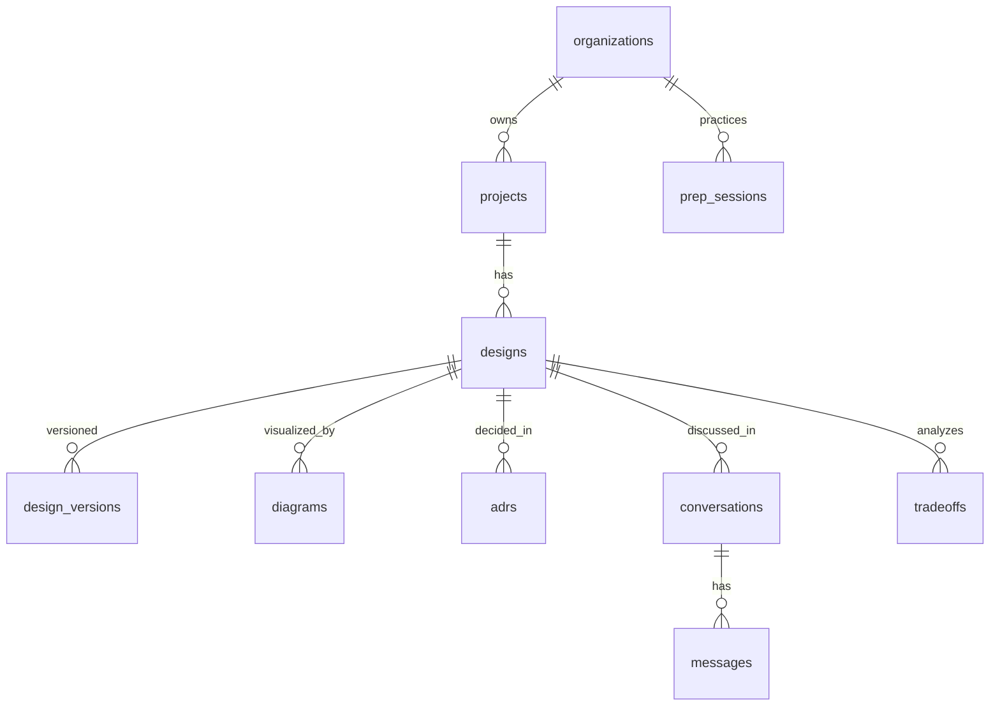

# System Design Assistant — DATABASE

PostgreSQL (+ pgvector for design search). `org_id`+RLS (D-004).

## Entities
`users`, `organizations`, `memberships`, `projects`, `designs` (title, problem, current state, version), `design_versions` (snapshots + diff), `diagrams` (Mermaid source, type, design_id), `adrs` (context/decision/consequences/status, links), `conversations`/`messages` (design dialogue), `tradeoffs` (option analyses), `prep_sessions` (interview practice: scenario, transcript, rubric score), `audit_logs`, `subscriptions`, `api_keys`. Optional `embeddings` for design memory search.

## ERD

## Notes
- `diagrams` store Mermaid source (text → diffable/versionable).
- `adrs` versioned + status (proposed/accepted/superseded); link to code/decisions in #1 (V2).
- Design memory reuses ContextOS (#1) context-store patterns; optional pgvector for "find similar designs."
- `prep_sessions` for the interview-prep market (transcript + rubric score + progress).
- `org_id` + RLS; standard backups. Light data volume.
