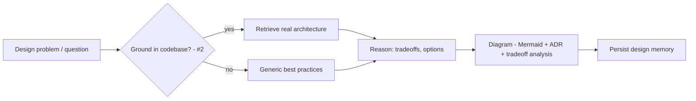

# AI System Design Assistant

> **Your AI co-architect.** Interactive system design, diagrams, ADRs, and tradeoff analysis — grounded in *your* codebase. Two markets: enterprise architecture and interview prep.

**Project #6** · Priority ⭐⭐ · Difficulty: Medium · Time-to-MVP: 4–6 weeks

## About this repository

This is **System Design Assistant (#6)**, extracted from a larger "AI Startup Lab." The root docs are the product spec/vision; references to sibling projects point to that broader context and aren't part of this standalone repo. Related repos: [`contextos`](https://github.com/MNikks01/contextos) (#1), [`codebase-intelligence`](https://github.com/MNikks01/codebase-intelligence) (#2), [`mcp-server-generator`](https://github.com/MNikks01/mcp-server-generator) (#3), [`agent-monitoring-platform`](https://github.com/MNikks01/agent-monitoring-platform) (#4), [`project-bootstrapper`](https://github.com/MNikks01/project-bootstrapper) (#5), [`agent-marketplace`](https://github.com/MNikks01/agent-marketplace) (#7).

**The working engine is in [`engine/`](./engine)** — generate architecture diagrams (Mermaid), draft ADRs, run weighted tradeoff analysis, persist/iterate design memory, and grade interview answers. Pure TypeScript, zero-network. Try it:
```bash
cd engine && node scripts/demo.ts && node scripts/test.ts
```

Licensed under **Apache-2.0** — see [LICENSE](./LICENSE).

## What
An assistant that helps engineers design systems: generate and iterate on architecture diagrams (Mermaid/diagram-as-code), produce ADRs (Architecture Decision Records), reason about tradeoffs (scaling, consistency, cost), and — uniquely — ground designs in the *actual codebase* (via Codebase Intelligence #2). Plus a prosumer **interview-prep** mode (practice system-design interviews with an AI interviewer/coach).

## Why
System design is high-stakes, under-tooled, and AI-assistable. Generic chatbots give unstructured advice with no persistence; diagram tools don't reason. Grounding design in real code (not generic patterns) is the differentiator. Two distinct revenue pools (enterprise architecture + interview prep) de-risk it.

## Who
Senior engineers/architects (design + ADRs), teams (shared design memory), and interview-preppers (prosumer). See [CUSTOMERS.md](./CUSTOMERS.md).

## How


## Capability ladder
- **MVP:** Conversational design, Mermaid diagram generation, ADR drafting, tradeoff analysis, save/iterate.
- **V1:** Codebase grounding (#2), design memory, teams, export (Confluence/MD), interview-prep mode.
- **V2:** Multi-agent design review, cost/scaling estimators, ContextOS integration.
- **V3:** Enterprise architecture governance, standards, on-prem.

## Doc map
[VISION](./VISION.md) · [PROBLEM](./PROBLEM.md) · [CUSTOMERS](./CUSTOMERS.md) · [FEATURES](./FEATURES.md) · [USER_STORIES](./USER_STORIES.md) · [ARCHITECTURE](./ARCHITECTURE.md) · [TECH_STACK](./TECH_STACK.md) · [DATABASE](./DATABASE.md) · [API_DESIGN](./API_DESIGN.md) · [AI_ARCHITECTURE](./AI_ARCHITECTURE.md) · [RAG](./RAG.md) · [MCP](./MCP.md) · [AGENT_DESIGN](./AGENT_DESIGN.md) · [SECURITY](./SECURITY.md) · [OBSERVABILITY](./OBSERVABILITY.md) · [GUARDRAILS](./GUARDRAILS.md) · [DEVOPS](./DEVOPS.md) · [TASKS](./TASKS.md) · [SPRINTS](./SPRINTS.md) · [PRICING](./PRICING.md) · [GTM](./GTM.md) · [SALES](./SALES.md) · [RISKS](./RISKS.md) · [HIRING](./HIRING.md) · [OPEN_SOURCE](./OPEN_SOURCE.md) · [RESUME_VALUE](./RESUME_VALUE.md) · [CLAUDE.md](./CLAUDE.md) · [AGENTS.md](./AGENTS.md) · [llms.txt](./llms.txt) · [mcp.json](./mcp.json)

*Build after the wedge; reuses Codebase Intelligence (#2) for grounding. Likely a ContextOS module + a standalone interview-prep product.*
